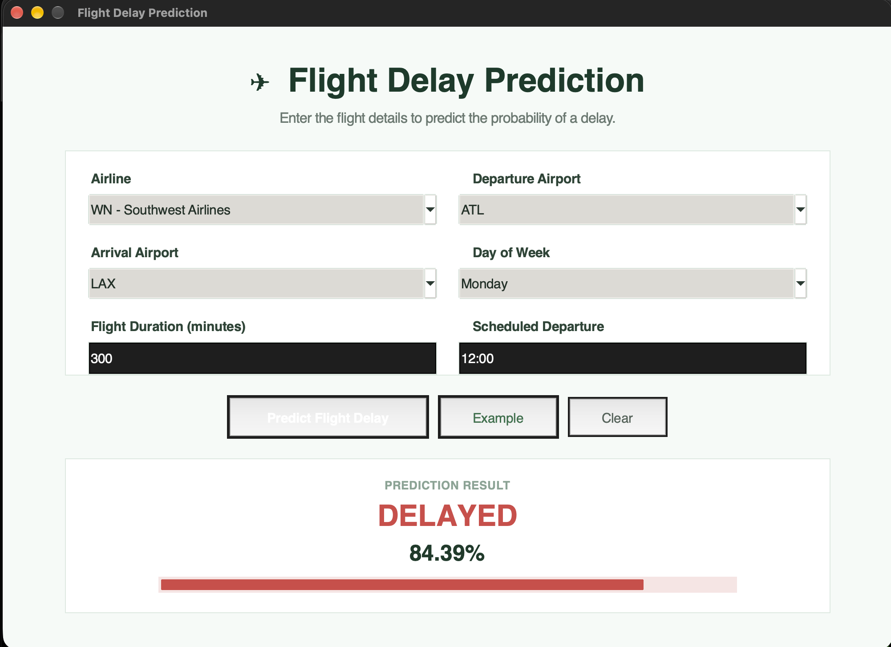
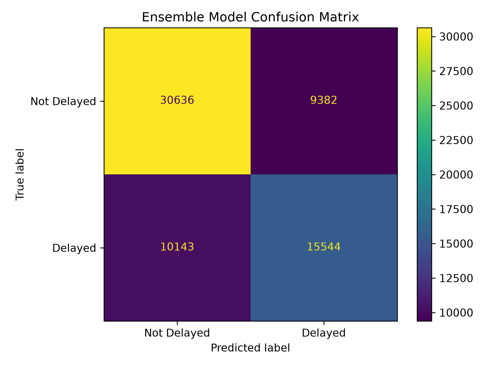
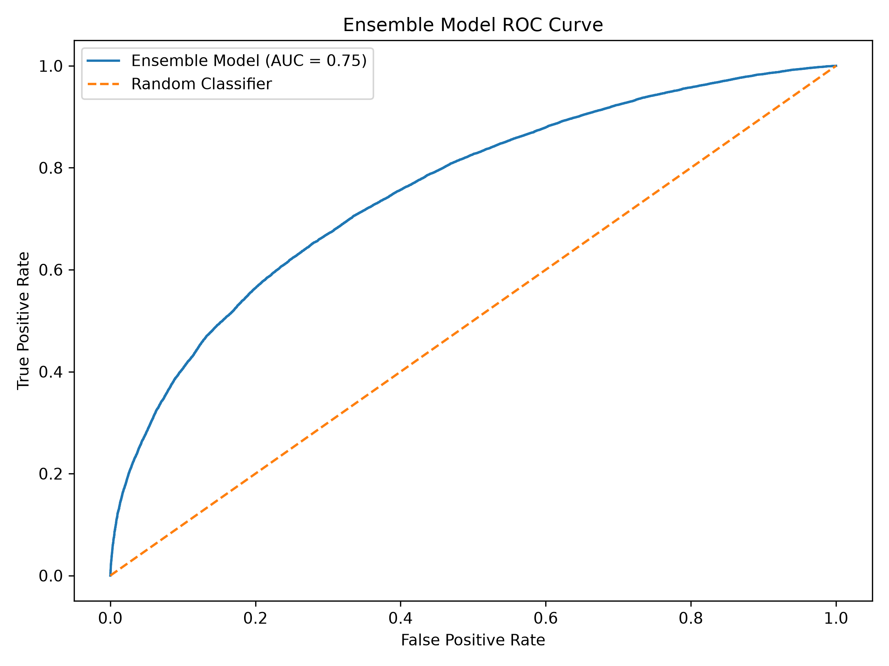
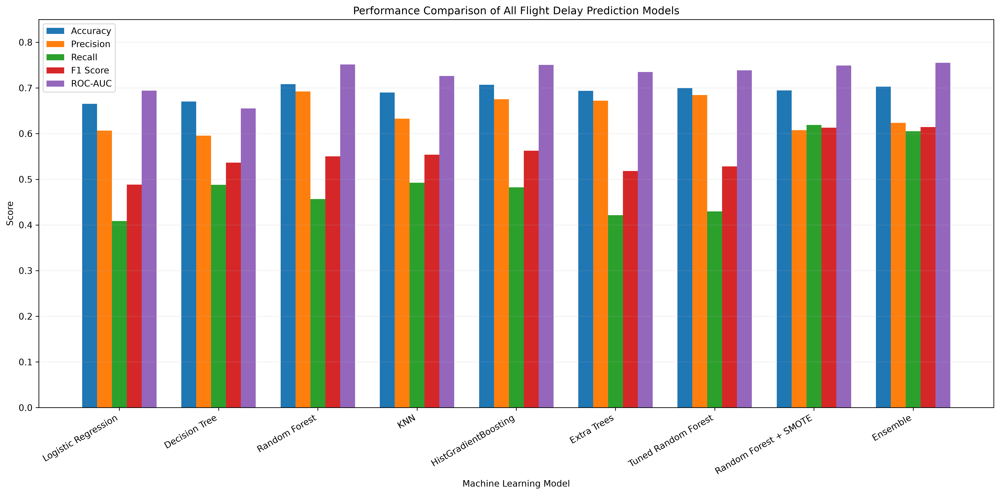

# Flight Delay Prediction


A machine learning project that predicts whether a flight will depart late, using only information known before departure.

The project was built in two versions. Version 1 is a baseline pipeline on a simple 9-column dataset. Version 2 moves to the `nycflights13` dataset, adds hourly weather, and ends with a probability-averaging ensemble.

## Table of Contents

- [Versions at a Glance](#versions-at-a-glance)
- [Version 1](#version-1)
- [Version 2](#version-2)
- [Version Comparison](#version-comparison)
- [Limitations](#limitations)
- [Project Structure](#project-structure)
- [Installation](#installation)
- [Running the Project](#running-the-project)

## Versions at a Glance

| | Version 1 | Version 2 |
|---|---|---|
| Dataset | Kaggle "Airlines Dataset to predict a delay" | `nycflights13` flights + hourly weather |
| Records | 539,383 | 328,521 (after removing cancelled flights) |
| Delay definition | Provided `Delay` column | `dep_delay > 0` minutes |
| Final model | Logistic Regression | Random Forest + HistGradientBoosting + KNN ensemble |
| Details | This page | [v2/README.md](v2/README.md) |

---

# Version 1

Dataset: [Airlines Dataset to predict a delay](https://www.kaggle.com/datasets/jimschacko/airlines-dataset-to-predict-a-delay/data), with 539,383 flights and 9 columns (`id`, `Airline`, `Flight`, `AirportFrom`, `AirportTo`, `DayOfWeek`, `Time`, `Length`, `Delay`). The target `Delay` is 0 for not delayed (55.46%) and 1 for delayed (44.54%).

## Method

- `id` and `Flight` were removed as identifier-like columns.
- Scheduled departure time was converted into cyclical features so that 23:59 and 00:01 are treated as close together:

```python
airlines["Time_sin"] = np.sin(2 * np.pi * airlines["Time"] / 1440)
airlines["Time_cos"] = np.cos(2 * np.pi * airlines["Time"] / 1440)
```

- Categorical features (`Airline`, `AirportFrom`, `AirportTo`, `DayOfWeek`) were one-hot encoded, and numerical features (`Length`, `Time_sin`, `Time_cos`) were standardised. This produced 614 input features.
- The data was split 80/20 with stratification (431,506 training and 107,877 test flights).

## Results

| Model | Accuracy | Precision | Recall | F1 | ROC-AUC |
|---|---:|---:|---:|---:|---:|
| Logistic Regression | 65.04% | 63.68% | 50.05% | 56.05% | 69.70% |
| Decision Tree | 60.76% | 57.22% | 47.20% | 51.73% | 61.30% |
| Random Forest | 61.52% | 57.11% | 54.74% | 55.90% | 65.18% |
| KNN | 63.01% | 59.10% | 55.10% | 57.03% | 66.16% |
| SVM | 65.03% | 63.90% | 49.42% | 55.73% | 69.68% |

Logistic Regression was selected as the Version 1 model. An XGBoost model tested separately reached 66.04% accuracy and 71.02% ROC-AUC, but it was kept out of the main comparison to stay within scikit-learn.

Five different algorithms all landed between 61% and 66%. That pattern suggests the limit was the information in the features, not the choice of algorithm: the dataset has no weather, exact date or aircraft history. This finding is what led to Version 2.

## Version 1 Interface

A CLI and a Tkinter GUI accept flight details and return a delay prediction with its probability.



---

# Version 2

Full details, all plots and every experiment are in [v2/README.md](v2/README.md). This section is a summary.

## Problem Definition

```text
delayed = 1  if dep_delay > 0 minutes
delayed = 0  otherwise
```

The baseline is **60.9% accuracy**, which is what a model gets by always predicting "not delayed". 39.1% of flights are delayed.

## Dataset

The `nycflights13` data covers flights departing from EWR, JFK and LGA in 2013. Hourly weather (temperature, dew point, humidity, wind, precipitation, pressure, visibility) was joined to each flight by departure airport and hour. Cancelled flights were removed because they cannot be labelled.

## Leakage Prevention

Columns only known during or after the flight were removed: `dep_time`, `arr_time`, `arr_delay`, `air_time`, and `dep_delay` itself (used only to build the target). All imputing, scaling and encoding is fitted on training rows only, inside scikit-learn pipelines.

## Features

```text
Categorical: carrier, origin, dest
Numerical  : month, day, sched_dep_time, sched_arr_time, distance, hour, minute,
             temp, dewp, humid, wind_dir, wind_speed, precip, pressure, visib
```

Missing weather values are filled with the training median. `flight` and `tailnum` are not used, because they have thousands of unique values.

## Results

Test-set results at the default 0.50 threshold unless stated:

| Model | Accuracy | Precision | Recall | F1 | ROC-AUC |
|---|---:|---:|---:|---:|---:|
| Logistic Regression | 66.52% | 60.67% | 40.86% | 48.83% | 69.42% |
| Decision Tree | 67.03% | 59.56% | 48.79% | 53.64% | 65.51% |
| KNN | 68.98% | 63.26% | 49.27% | 55.39% | 72.61% |
| Random Forest + SMOTENC | 69.47% | 60.75% | 61.89% | 61.32% | 74.89% |
| HistGradientBoosting (tuned) | 70.69% | 67.52% | 48.23% | 56.27% | 75.07% |
| Random Forest | 70.83% | 69.23% | 45.67% | 55.04% | 75.14% |
| Ensemble, threshold 0.50 | 71.14% | 68.73% | 48.02% | 56.54% | 75.49% |
| Ensemble, threshold 0.43 | 70.28% | 62.36% | 60.51% | 61.42% | 75.49% |

Extra Trees and a tuned Random Forest were also tested; see [v2/README.md](v2/README.md) for the full table.

## Class Imbalance and SMOTENC

The plain models miss many delayed flights (most have recall below 50%). `SMOTENC` was applied to the training data only to create synthetic delayed flights (training set from 262,816 to 320,142 rows, balanced 50/50). It raised recall from about 46% to 62% with a small accuracy cost. The test set was never resampled.

## Final Ensemble

The final model averages the delay probabilities of three models, then applies a threshold:

```python
ensemble_proba = (rf_proba + hgb_tuned_proba + knn_proba) / 3
ensemble_pred = (ensemble_proba >= 0.43).astype(int)
```

The ensemble has the best ROC-AUC (75.49%). The saved system uses a threshold of 0.43, which trades a little accuracy for much higher recall (60.5% instead of 48.0%). This threshold was picked by scanning values against the test set, so its scores are slightly optimistic. The 0.50 row involves no tuning and is the cleaner estimate.

Confusion matrix at threshold 0.43:

```text
True Negative  = 30,636    False Positive =  9,382
False Negative = 10,143    True Positive  = 15,544
```







## Time-Based Check

A random split lets the model train on flights from the same days as its test flights, which can flatter the score. To check this, models were trained on January to September and tested on October to December.

| Model | ROC-AUC, random split | ROC-AUC, time-based |
|---|---:|---:|
| Logistic Regression | 0.694 | 0.655 |
| Random Forest + SMOTE | 0.749 | 0.693 |

Both models still beat the 63.15% accuracy baseline of the later months, but ROC-AUC drops by about 0.05 to 0.06. For genuinely future flights, expect results closer to the time-based numbers.

## Version 2 Interface

The CLI and Tkinter GUI load the saved models and take airline, departure airport, destination airport, month, day, scheduled departure and arrival times, and distance. They show the final prediction, the ensemble score, the threshold, and each model's score.


---

# Version Comparison

The two versions use different datasets with different baselines, so raw accuracy is not directly comparable. The gain over each baseline is the fairer measure.

| | Version 1 | Version 2 |
|---|---:|---:|
| Baseline accuracy (always "not delayed") | 55.46% | 60.91% |
| Final accuracy | 65.04% | 71.14% (0.50) or 70.28% (0.43) |
| Gain over baseline | +9.6 points | +10.2 or +9.4 points |
| ROC-AUC | 69.70% | 75.49% |
| Recall for delayed flights | 50.05% | 48.02% (0.50) or 60.51% (0.43) |

Honest summary: the accuracy gain over baseline is similar in both versions, at about 9 to 10 points. The clearer improvement in Version 2 is ranking quality (ROC-AUC up by about 5.8 points) and the ability to catch more delayed flights when the threshold is lowered.

# Limitations

- **Observed weather, not forecast.** The weather columns are measurements from the departure hour. A real pre-departure system would only have a forecast, which is less accurate.
- **Random split optimism.** The time-based check shows lower ROC-AUC than the random split.
- **Threshold chosen on the test set.** The 0.43 threshold used test labels, so its scores are slightly optimistic.
- **One year, three airports.** All flights are from 2013 and depart from NYC, so the model may not transfer elsewhere.
- **No aircraft history.** Late incoming aircraft are a major cause of delay, and `tailnum` history is not used.
- **Accuracy target.** A 75% accuracy target was not reached. The honest result is about 70 to 71% accuracy, roughly 10 points above the baseline.

# Project Structure

```text
flight-delay-prediction/
├── v1/
│   ├── data/
│   ├── models/
│   ├── plots/
│   ├── cli.py
│   ├── gui.py
│   └── flight_delay_prediction.ipynb
├── v2/
│   ├── data/
│   ├── models/
│   ├── plots/
│   ├── 01_explore.ipynb
│   ├── cli.py
│   ├── gui.py
│   └── README.md
├── demo/
│   ├── gui.png
│   └── gui_v2.png
├── .gitignore
└── README.md
```

Dataset CSV files are not stored in the repository. Download them from Kaggle and place them in the matching `data/` folder before running a notebook.

# Installation

```bash
git clone https://github.com/gyan-prakash-007/flight-delay-prediction.git
cd flight-delay-prediction

python3 -m venv .venv
source .venv/bin/activate

pip install numpy pandas matplotlib scikit-learn scipy imbalanced-learn joblib jupyter
```

Tkinter ships with Python, so it needs no separate install.

# Running the Project

Version 1:

```bash
cd v1
python cli.py
python gui.py
jupyter notebook flight_delay_prediction.ipynb
```

Version 2:

```bash
cd v2
python cli.py
python gui.py
jupyter notebook 01_explore.ipynb
```

# Technologies Used

Python, NumPy, Pandas, Matplotlib, scikit-learn, imbalanced-learn, Joblib, Tkinter, Jupyter Notebook.

# Conclusion

Version 1 built a clean baseline and, by trying five algorithms that all plateaued, showed that the features were the limit. Version 2 added weather and date information, handled class imbalance, tested a time-based split, and combined three models into a probability-averaging ensemble. The result is a modest but real improvement over the baseline, reported with its limitations.